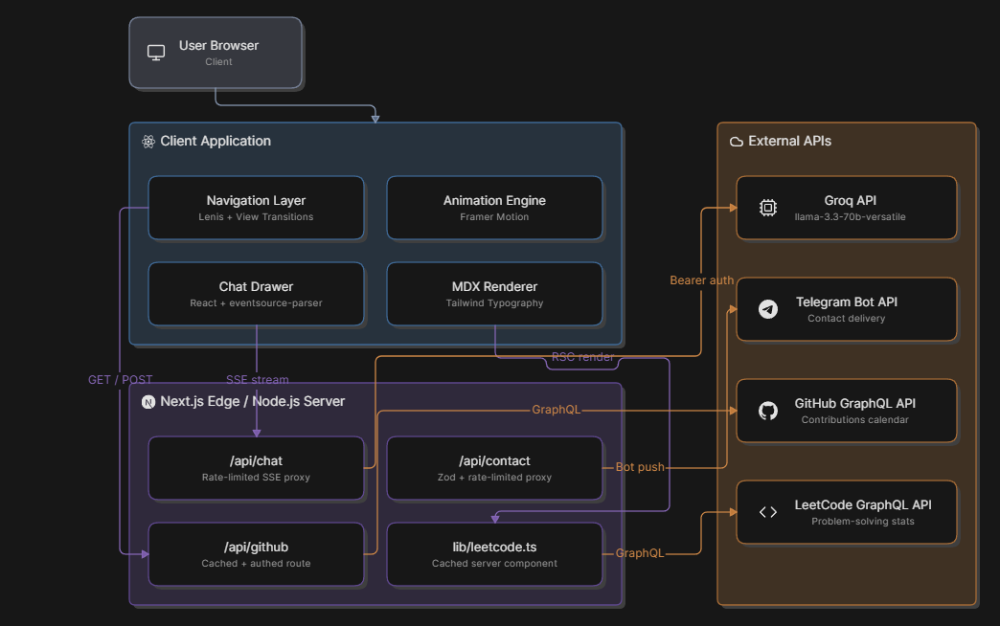
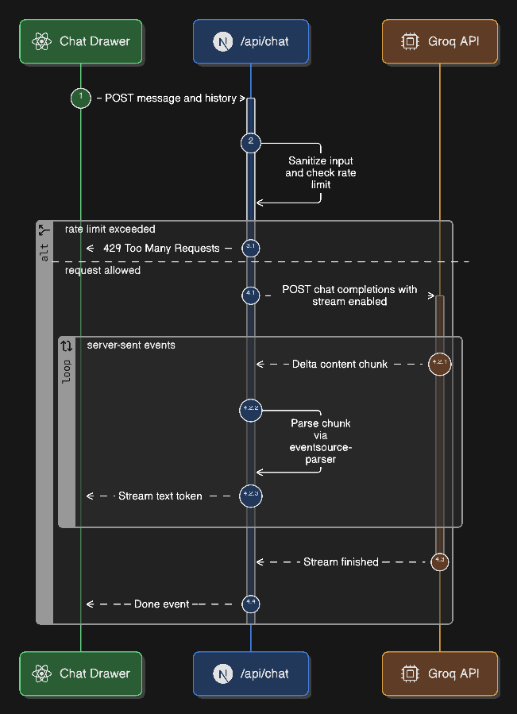
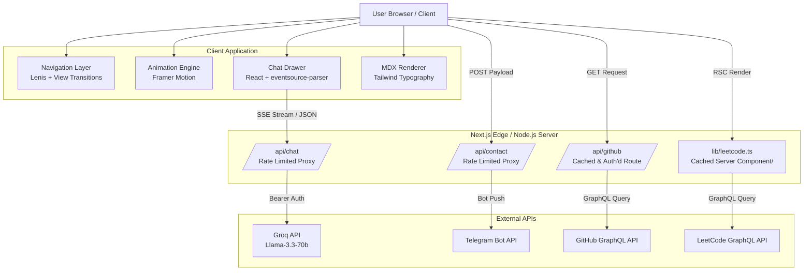
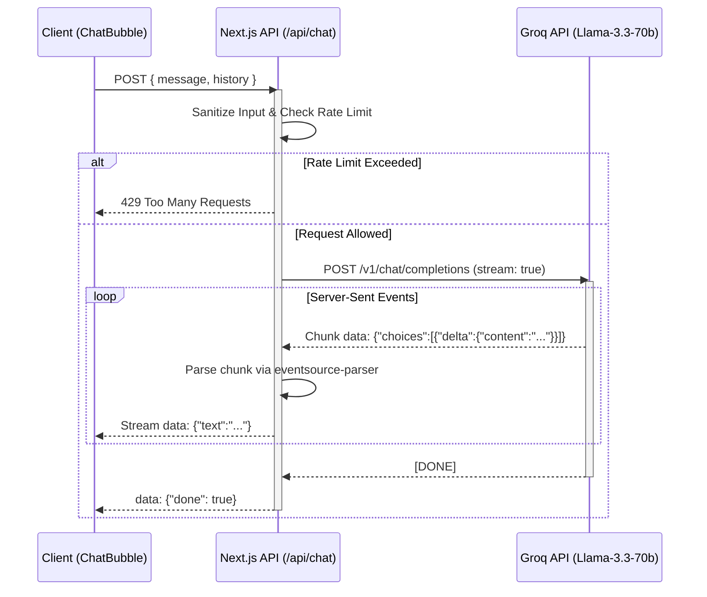
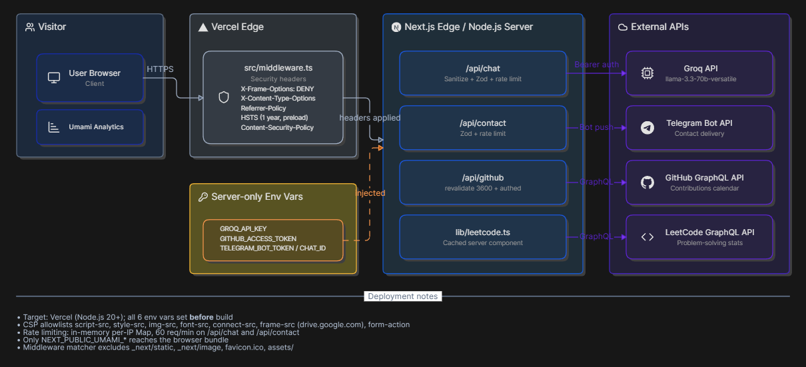

# **Advaith R Pai - Personal Portfolio**


**A production-grade personal portfolio with AI chat, live developer metrics, MDX content, and serverless integrations.**

[Features](#features) • [Tech Stack](#tech-stack) • [Getting Started](#getting-started) • [Architecture](#architecture) • [State Management](#state-management) • [Security](#security) • [Deployment](#deployment)

## **About**

This is my personal portfolio - a living engineering showcase rather than a static resume. It demonstrates full-stack capability through real integrations: an AI assistant that can discuss my work, live GitHub contribution data, LeetCode problem-solving stats, and a contact form that routes to Telegram.

Unlike template portfolios, every section is wired to live data or server-side logic. The chat runs on Groq’s `llama-3.3-70b-versatile` with prompt-injection defenses. The GitHub section uses authenticated GraphQL instead of scraping. MDX powers the blog and project case studies so I can embed interactive components inside markdown.

I built this to reflect how I actually work: iterative, data-aware, and focused on edge cases like rate limiting, error states, and responsive accessibility.

## **Features**

### _AI Portfolio Assistant_

- **Context-aware chat** - bottom-right drawer powered by Groq, trained on my resume, projects, and journey
- **Streaming responses** - Server-Sent Events with real-time text generation
- **Input sanitization** - regex-based defense against prompt injection before payloads reach the API
- **Rate limiting** - IP-based `Map` store enforcing 60 requests/minute per client
- **Persistent history** - localStorage-backed conversation that survives reloads, with a clear-chat affordance

### _Live Developer Metrics_

- **GitHub activity** - authenticated GraphQL fetch of contributions calendar, rendered with `react-activity-calendar`, cached for 1 hour
- **LeetCode stats** - GraphQL extraction of problem-solving breakdown, displayed as an interactive SVG donut chart with hover/keyboard accessibility

### _Content Engine_

- **MDX case studies and blogs** - authored in `.mdx` with embedded React components, syntax highlighting, and custom typography via Tailwind
- **Scroll-triggered animations** - `Reveal` wrapper using `framer-motion` `whileInView` with `prefers-reduced-motion` support
- **Smooth scrolling** - Lenis singleton provider managing `autoRaf`, `smoothWheel`, and touch multipliers

### _UI/UX Polish_

- **View transitions** - `next-view-transitions` for app-like navigation with guarded `document.startViewTransition` fallback
- **Haptic feedback** - mobile vibration via `navigator.vibrate()` on chat toggle and interactions
- **Responsive glass styling** - consistent `bg-white/80 backdrop-blur-sm` / `dark:bg-black/60` treatment across cards
- **Keyboard navigation** - arrow-key chat repositioning, accessible chart legends with `role="button"` and `aria-pressed`

### _Infrastructure_

- **Security middleware** - `src/middleware.ts` sets `X-Frame-Options`, `X-Content-Type-Options`, `Referrer-Policy`, `Strict-Transport-Security`, and a scoped `Content-Security-Policy`
- **Edge caching** - GitHub data cached server-side with `revalidate: 3600` and `stale-while-revalidate=86400`
- **Telegram routing** - contact form posts to `/api/contact`, which forwards validated payloads to Telegram Bot API
- **Umami analytics** - privacy-focused tracking loaded conditionally when env vars are present

## **Tech Stack**

### _Frontend_

| Technology                | Purpose                                                                     |
| ------------------------- | --------------------------------------------------------------------------- |
| **Next.js 15**            | App Router, Server Components, API routes, and static generation            |
| **React 19**              | Core UI library with client/server component model                          |
| **Tailwind CSS 4**        | Utility-first styling, fluid typography, and theme variables                |
| **Framer Motion**         | Scroll-triggered `Reveal` animations and chat `AnimatePresence` transitions |
| **Shadcn UI + Radix**     | Accessible primitives for dialogs, buttons, inputs, and scroll areas        |
| **next-themes**           | Theme provider with system preference detection                             |
| **next-mdx-remote/rsc**   | Server-side MDX rendering for blog and project content                      |
| **Lenis**                 | Smooth scrolling physics with singleton provider                            |
| **next-view-transitions** | CSS view-transition-based page navigation                                   |

### _Backend / APIs_

| Technology                               | Purpose                                     |
| ---------------------------------------- | ------------------------------------------- |
| **Groq API (`llama-3.3-70b-versatile`)** | LLM inference for chat assistant            |
| **GitHub GraphQL**                       | Authenticated contribution calendar fetch   |
| **LeetCode GraphQL**                     | Scraped stats for problem-solving dashboard |
| **Telegram Bot API**                     | Serverless contact form delivery            |
| **Umami**                                | Self-hostable analytics with WAF protection |

### _Tooling_

| Technology                          | Purpose                                                 |
| ----------------------------------- | ------------------------------------------------------- |
| **Bun**                             | Package manager and script runner                       |
| **TypeScript 5**                    | Static typing across app, API routes, and utilities     |
| **Zod**                             | Runtime schema validation for contact and chat payloads |
| **eventsource-parser**              | SSE stream parsing for Groq chat responses              |
| **react-markdown + rehype plugins** | Safe MDX content rendering                              |

## **Project Structure**

```text
src/
├── app/                          # Next.js App Router
│   ├── api/                      # Server API routes
│   │   ├── chat/route.ts         # Groq SSE proxy with sanitization + rate limiting
│   │   ├── contact/route.ts      # Zod-validated Telegram forwarding
│   │   └── github/route.ts       # Authenticated GraphQL proxy
│   ├── blog/                     # MDX blog engine
│   │   ├── [slug]/page.tsx       # Post detail with Reveal animation
│   │   ├── BlogPageClient.tsx    # Tag filtering + URL sync
│   │   └── page.tsx              # Server listing with skeleton loading
│   ├── projects/
│   │   ├── [slug]/page.tsx       # Project case study with related projects
│   │   └── page.tsx              # Project listing page
│   ├── journey/page.tsx          # MDX timeline page
│   ├── resume/page.tsx           # Resume embed/download page
│   ├── work-experience/page.tsx  # Experience listing page
│   ├── contact/page.tsx          # Contact form page
│   ├── layout.tsx                # Root layout with LenisProvider, ChatBubble, BackToTop
│   ├── page.tsx                  # Homepage landing sections
│   ├── globals.css               # Tailwind + Lenis + grid background + custom animations
│   └── icon.png                  # Favicon
├── components/
│   ├── analytics/
│   │   └── UmamiAnalytics.tsx    # Conditional script loader
│   ├── common/
│   │   ├── Reveal.tsx            # Scroll-triggered motion wrapper
│   │   ├── LenisProvider.tsx     # Smooth-scroll singleton
│   │   ├── ChatBubble.tsx        # Draggable chat with localStorage persistence
│   │   ├── BackToTop.tsx         # Fixed corner button
│   │   ├── Navbar.tsx            # Simplified nav without logo/sheet
│   │   ├── ThemeSwitch.tsx       # View-transition-aware theme toggle
│   │   └── TrackedLink.tsx       # Analytics-guarded anchor wrapper
│   ├── landing/
│   │   ├── Hero.tsx              # Entrance animation + social links
│   │   ├── GitHub.tsx            # Contributions calendar with glass fallback
│   │   ├── GitHubCalendarClient.tsx # Dynamic ActivityCalendar wrapper
│   │   ├── LeetCode.tsx          # Server stats section with fallback
│   │   ├── LeetCodeChartClient.tsx # Interactive SVG donut chart
│   │   ├── CTA.tsx               # Glass card + simplified hover button
│   │   ├── About.tsx             # Profile section with dedicated image
│   │   └── ...
│   ├── contact/
│   │   └── ContactForm.tsx       # Glass-styled form with Telegram backend
│   └── ui/                       # Shadcn/Radix accessible primitives
├── config/
│   ├── CTA.tsx
│   ├── GitHub.ts
│   ├── LeetCode.ts
│   ├── Navbar.tsx                # Nav items (logo removed)
│   ├── Projects.tsx              # Project metadata + live Vercel links
│   ├── Resume.ts                 # Drive preview embed URL
│   └── Meta.ts                   # SEO metadata generator
├── data/
│   └── journey/
│       └── journey.mdx           # Timeline narrative content
├── hooks/
│   ├── use-haptic-feedback.ts    # Vibration API wrapper for mobile
│   └── use-umami.ts              # Analytics event tracker
├── lib/
│   ├── github.ts                 # Typed GraphQL fetcher + normalization
│   ├── leetcode.ts               # Typed GraphQL fetcher + normalization
│   ├── contact-schema.ts         # Zod validation for contact form
│   └── blog.ts                   # MDX reading time, date formatting, tag filtering
└── middleware.ts                 # Security headers + Content-Security-Policy

```

## **Architecture**





### _Overall Component Architecture_



### _Request / Response Pipeline (Chat SSE Proxy)_



## **State Management**

The portfolio utilizes strict state handling protocols to ensure performance and prevent React hydration errors, specifically within the dynamic chat component.

### _SSE Streaming State_

The browser does not interface with the Groq API directly. Instead, the Next.js API route streams Server-Sent Events (SSE). On the client side:

1. `eventsource-parser` intercepts the incoming raw text stream.
2. Parsed JSON chunks isolate the `text` delta payload.
3. React state `accumulatedText` is updated iteratively, appending new text to the currently active message object based on a unique UUID `botMessageId`.
4. This ensures fluid, typewriter-style rendering without dropping frames or requiring heavy multi-state re-renders.

### _Local Storage Hydration_

To persist conversation history across page reloads without triggering server-client UI mismatches:

1. The `ChatBubble` component initiates with a static default state (`initialMessages`) containing only the greeting. This guarantees the server-rendered HTML perfectly matches the initial client HTML.
2. A `useEffect` hook runs exclusively on the client immediately after mount, checking `localStorage` for previous sessions.
3. If history exists, it sanitizes any trailing `isStreaming: true` flags (in case the user refreshed mid-generation) and updates the component state.
4. An `isInitialized` flag acts as a gatekeeper, ensuring `localStorage` is only updated _after_ the component has fully mounted and hydrated, preventing accidental overwrites of existing history.

## **Getting Started**

### _Prerequisites_

- **Bun** v1.0+
- **Node.js** v20.x+
- Git

### _Installation_

```bash
# 1. Clone
git clone https://github.com/aridepai17/ADVAITH-R-PAI-PORTFOLIO.git
cd ADVAITH-R-PAI-PORTFOLIO

# 2. Install dependencies
bun install

# 3. Copy environment file
cp .env.example .env.local

# 4. Start dev server
bun run dev

```

Open `http://localhost:3000`.

### _Environment Variables_

| Variable                | Required | Purpose                               |
| ----------------------- | -------- | ------------------------------------- |
| `GROQ_API_KEY`          | Yes      | Groq LLM inference for chat           |
| `GITHUB_ACCESS_TOKEN`   | Yes      | GitHub GraphQL authenticated requests |
| `TELEGRAM_BOT_TOKEN`    | Yes      | Contact form Telegram delivery        |
| `TELEGRAM_CHAT_ID`      | Yes      | Contact form destination chat         |
| `NEXT_PUBLIC_UMAMI_URL` | Yes      | Umami analytics script origin         |
| `NEXT_PUBLIC_UMAMI_ID`  | Yes      | Umami website identifier              |

**Degradation behavior:**

- `NEXT_PUBLIC_UMAMI_*` missing: analytics silently omitted
- `GROQ_API_KEY` missing: chat returns 500
- `GITHUB_ACCESS_TOKEN` missing: GitHub API route returns 500
- Telegram vars missing: contact form returns 500

### _Verification_

This repo includes `src/validate/testTelegram.ts` to isolate Telegram config from app-code issues:

```bash
npx tsx src/validate/testTelegram.ts

```

### _Available Scripts_

| Command         | Purpose                                      |
| --------------- | -------------------------------------------- |
| `bun run dev`   | Start development server on `localhost:3000` |
| `bun run build` | Production build                             |
| `bun run lint`  | Next.js lint                                 |
| `bun run start` | Run production build                         |

## **Deployment**

Target: **Vercel** (or any Node.js 20+ host).

### _Vercel-specific notes_

1. Set all 6 environment variables in the Vercel dashboard **before** deploying. Env vars added after build do not retroactively apply to serverless functions.
2. The `src/middleware.ts` CSP includes `frame-src https://drive.google.com` for the resume embed; if you change the resume provider, update `frame-src` accordingly.
3. `next.config.ts` allows `assets` and `api` origin; if you add new static asset paths, verify the CSP allows them.
4. Fonts in `public/fonts/` are served as-is; no build transform is applied.

### _Other hosts_

- Ensure Node.js 20+ runtime.
- Ensure `bun.lock` is respected or run `bun install` during build.
- Middleware matcher excludes `_next/static`, `_next/image`, `favicon.ico`, `assets/`, and common image extensions.

## **Security**



- **Prompt injection defense** - regex sanitation applied to user messages and conversation history before sending to Groq
- **Rate limiting** - in-memory `Map` tracking per-IP request counts on `/api/chat` and `/api/contact`
- **Input validation** - Zod schemas enforce shape and length on all API inputs
- **Secret handling** - `GROQ_API_KEY`, `GITHUB_ACCESS_TOKEN`, and Telegram vars are server-only; only `NEXT_PUBLIC_UMAMI_*` is exposed to the browser
- **Security headers** - middleware sets `X-Frame-Options: DENY`, `X-Content-Type-Options: nosniff`, `Referrer-Policy: strict-origin-when-cross-origin`, and HSTS with 1-year max-age and preload
- **Content Security Policy** - restricts `script-src`, `style-src`, `img-src`, `font-src`, `connect-src`, `frame-src`, and `form-action` to explicit allowlists
- **No sensitive data in client bundle** - API keys and tokens are never imported into client components

## **Acknowledgments**

- **Vercel** - Next.js framework and edge runtime
- **Shadcn UI** - accessible component primitives built on Radix UI
- **Framer Motion** - animation library
- **Lenis** - smooth scrolling
- **react-activity-calendar** - GitHub contribution visualization
- **Groq** - LLM inference provider

## **Connect**

If this portfolio was useful or interesting, consider starring the repository - it helps other developers discover it.

- **GitHub:** [@aridepai17](https://github.com/aridepai17)
- **X / Twitter:** [@rpaiv17](https://x.com/rpaiv17)
- **LinkedIn:** [Advaith R Pai](https://www.linkedin.com/in/advaith-r-pai/)
- **LeetCode:** [advaithrpai17](https://leetcode.com/advaithrpai17)
- **Email:** [advaithdepai26@gmail.com](mailto:advaithdepai26@gmail.com)
